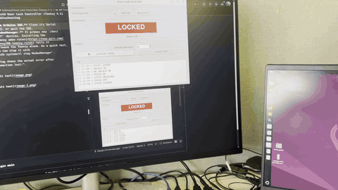
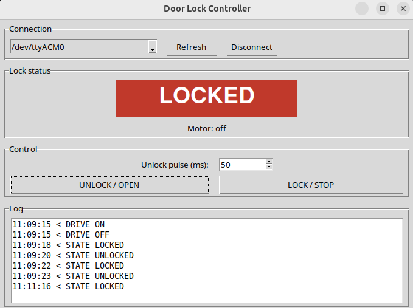
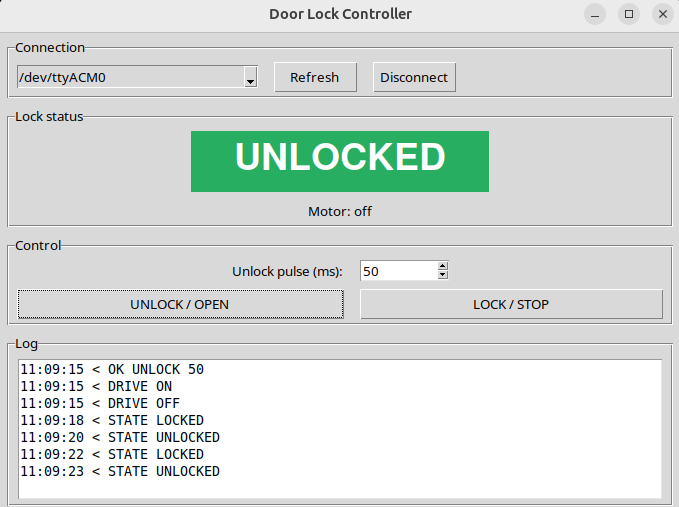

<p align="center">
  
</p>

# Solenoid Door Lock Controller (Teensy 4.1)

Open a 12V motor-driven rotary latch lock from a desktop GUI.



| Locked | Unlocked |
|---|---|
|  |  |


## How this kind of lock works

This is a **motor-driven rotary latch**, not a simple solenoid that holds open
while powered:

- **Red / black** are the 12V motor power. A short pulse of 12V (about
  0.3–1 s) makes the motor release the latch.
- **Yellow / white** are the **status microswitch**. It's a plain switch
  contact that tells you if the latch is locked or open. It is *not* an
  input for driving the lock.
- **Locking happens mechanically.** Pushing the door shut re-engages the
  latch. That's why the GUI has **UNLOCK / OPEN** to fire the pulse, and
  **LOCK / STOP** only cuts motor power at once (as an abort).
- **Don't hold 12V on it continuously.** The firmware caps every pulse at
  3 s to protect the motor.

> Check your wire colours with a multimeter before connecting. With no power
> on the lock, measure continuity across yellow/white and move the latch by
> hand. The reading should switch between open and closed.


## Uploading the firmware to the Teensy 4.1

1. Install the [Arduino IDE](https://www.arduino.cc/en/software) (2.x).
2. Add Teensy support. Go to **File → Preferences → Additional boards manager
   URLs** and add
   `https://www.pjrc.com/teensy/package_teensy_index.json`. Then open
   **Boards Manager**, search for **Teensy** and install it.
3. Open `firmware/solenoid_lock/solenoid_lock.ino`.
4. Pick **Tools → Board → Teensy 4.1** and **Tools → USB Type → Serial**.
5. Click **Upload**. Press the button on the Teensy if the loader asks you to.

To test without the GUI, open the Serial Monitor (newline line ending) and
type `STATUS`, `UNLOCK`, `UNLOCK 800` or `LOCK`.

## Running the GUI

```bash
cd gui
pip install -r requirements.txt
python lock_gui.py
```

1. Pick the Teensy's port. It's selected automatically when it's detected
   (`COMx` on Windows, `/dev/ttyACM0` on Linux, `/dev/cu.usbmodem…` on macOS).
2. Click **Connect**.
3. Set the unlock pulse time (500 ms is a good starting point) and press
   **UNLOCK / OPEN**.
4. The big indicator follows the microswitch live: **LOCKED** is red and
   **UNLOCKED** is green.

Close the Arduino Serial Monitor first, because only one program can use
the port at a time. On Linux, Tkinter may need `sudo apt install python3-tk`,
and you may need the
[Teensy udev rules](https://www.pjrc.com/teensy/00-teensy.rules).
